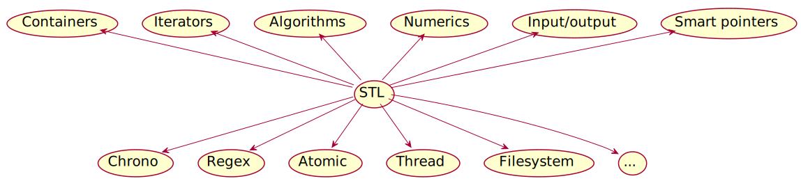

# Обзор языка {#review}

* Фундаментальные типы данных
* Примитивные объекты -- контейнеры
* Стандартная библиотека шаблонов STL
* Расширенная библиотека -- Boost
* Развитие языка -- новые стандарты
* Актуальная информация -- <http://cppreference.com>

---

## Стандартная библиотека шаблонов {#stl}

## Контейнеры {#containers}

* Последовательные (vector, array, list)
* Ассоциативные (map, set)
* Хеш-контейнеры (unordered\_set, unordered\_map)
* Адапторы (stack, priority\_queue, queue)
* Span (view) -- C++20

## Итераторы {#iterators}

* Созданы для абстракции контейнера от алгоритма
* 6 видов по типам контейнеров:
    * Contigues -- непрерывный (указатели)
    * RandomAccess -- с произвольным доступом (vector)
    * Bidirectional -- есть инкремент и декремент (list)
    * ForwardIterator -- есть инкремент (forward\_list)
    * Input -- чтение, можно пройтись итератором только один раз (istream)
    * Output -- запись, можно пройтись итератором только один раз (ostream)
* Могут быть полностью абстрагированы от контейнера
* Потоки вводы/вывода обладают своими инераторами
* Адапторы (reverse, back\_inserter)
* Операции -- advance, distance, next, prev

## Алгоритмы {#algorithms}

* Почти все алгоритмы работают с итераторами
* Не модифицирующие последовательные операции (count, find)
* Модификаторы (fill, copy, transform)
* Сортировки (sort, nth\_element, partition)
    * Поиск (binary\_search, lower\_bound)
    * Операции с множествами (merge, includes, set\_union)
* Минимумы/максимумы (min, minmax, min\_element, clamp)
* Аккумуляторы (iota, accumulate, transform\_reduce)
* Политики запуска алгоритмов (seq, par, par\_unseq)

## Математические расширения {#math-extension}

* Общие математические функции -- cmath, cstdlib
* Специальные математические функции (cyl\_bessel\_i, expint, riemann\_zeta)
* Complex, valarray
* Аккумуляторы, gcd, lcm
* Псевдослучаные последовательности
    * Псевдогенераторы (mersenne\_twister\_engine, linear\_congruential\_engine)
    * Адапторы генераторов (shuffle\_order\_engine, discard\_block\_engine)
    * Недетерменированный генератор (random\_device)
    * Функции распределения (uniform\_int\_distribution, normal\_distribution)
* Рациональные числа уровня компиляции (нужно для `std::crhono`)
* Управление FPE для работы с плавающей точкой

## Потоковый ввод/вывод {#streams}

* Итераторы (strembuf\_iterator, stream\_iterator) -- InputIterator, OutputIterator
* Потоковые объекты -- stringstream
* I/O манипуляторы
* `boost::format` -- самое лучшее от `printf`
* `boost::iostreams` -- расширение `std::iostream`

## Умные указатели {#smart-pointers}

* Обёртка на `new`, `delete`
* Слабые указатели (weak\_ptr)
* Совместно используемые указатели (shared\_ptr)
* Уникальные указатели (unique\_ptr)
* Потокобезовасность -- перегрузка оператора `->`
* Утилиты:
    * enable\_shared\_from\_this
    * Умные указатели поддерживают пользовательные деструкторы
    * Аллокаторы
* Разиличие `delete` и `delete[]` → умные указатели и массивы

## Управление временем {#chrono}

* Бибилиотека `std::chrono`
* 3 класса для работы со временем:
    * `clocks` -- замер времени
        * `system_clock` -- системное время
        * `steady_clock` -- монотонное время, никогда не возвращается назад
        * `high_resolution_clock` -- самое точное время
        * `utc_clock`, `file_clock`, ...
    * `time_point` -- временная метка
    * `duration` -- разница между временными метками
* Кастование между различными величинами `duration`
* Календарь и временная зона -- C++20
* Строковые константы -- `42s`, `1min`, `2us` (C++14)

## Регулярные выражения {#regex}

<https://ru.wikipedia.org/wiki/Регулярные_выражения>

* Библиотека `std::regex`
* Основные функции:
    * Построение регулярки -- конструктор
    * `regex_match` -- соответствие предложения регулярному выражению
    * `std::smatch`, `std::cmatch` -- объекты совпадения
    * `regex_search` -- поиск регулярного выражения
    * `regex_replace` -- поиск и замена
* Строковые литералы (`R"match\t\n"` <=> `"match\\t\\n"`)
* Опции и типы ругялярок -- icase, multiline, ECMAScript, grep, ...

## Атомарные операции {#atomic}

* Сделать тип `T` атомарным -- `std::atomic<T>`
* Поддержка атомарных операций (fetch\_add, exchange)
* Барьеры памяти
* Специальный тип `atomic_flag` -- `test_and_set`

## Потоки {#threads}

* POSIX интерфейс
* Мьютексы:
    * mutex, timed\_mutex, recursive\_mutex, shared\_mutex
    * Локеры -- lock\_guard, scoped\_lock, unique\_lock, shared\_lock
* Условные переменные
    * Необходимо иметь синхронизирующий мьютекс
* Асинхронные операции:
    * `promise` -- в него устанавлиют результат асинхронно
    * `future` -- объект, который выполнится в неизвестное время
    * `async` -- обёртка над `future`
* Объект потока `std::thread`
    * `yield`, `sleep_for`
    * `join`, `detach`

## Работа с файловой системой {#filesystem}

* Отдельное подпространство имён `std::filesystem`
* Класс `path` -- абстракция пути в файловой системе
* Методы `path` позволяют модифицировать путь
* Создание директорий, символических ссылок
* Рекурсивный обход директории -- `recursive_directory_iterator`
* Получение информации о файле -- `file_status`
* Получение доступного места на файловой системе -- `space_info`
* Функции для работы с файлами:
    * exists, file\_size, absolute, space
    * copy\_file, remove
    * rename, resize\_file
    * current\_path
    * temp\_director\_path
