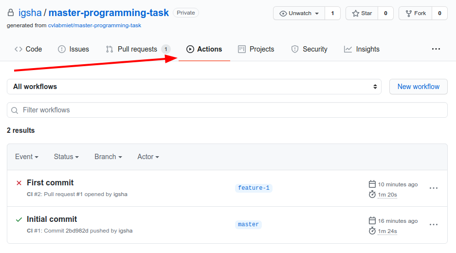
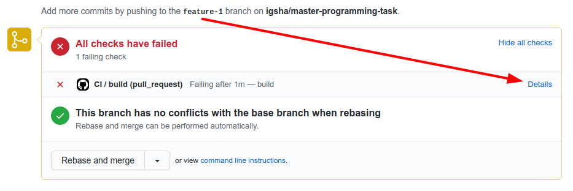
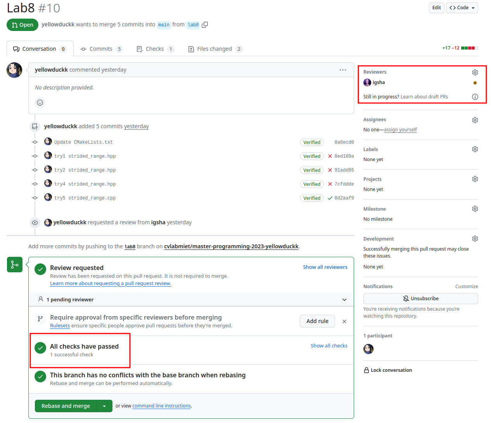
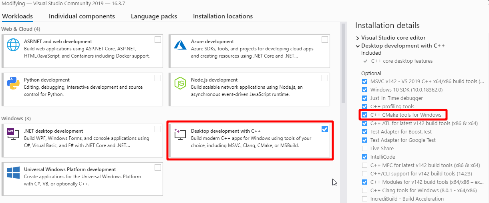

= Master programming pass:[ ] Лабораторные работы
:author: Игорь Шаронов
:date: 2021-09-05
:data-uri:
:numbered:
:lang: ru

== Описание домашней работы

=== Из чего состоят задания

* Домашнее задание \<\=> лабораторные работы
* 1 задание на ознакомление с системой проверки (3 балла)
* 6 заданий на написание кода (11 баллов)
* 1 задание на написание теста (11 баллов)
* всего 8 заданий с общим весом в 80 баллов
* 5 дополнительных вопросов для самопроверки
* 5 дополнительных заданий на самостоятельную работу

=== Порядок сдачи лабораторной работы

* Создаём пулл-реквест со сделанной и протестированной лабораторной
* Вешаем его на `igsha`
* **Не нужно** спрашивать ревьювера, когда он будет проверять работу
* Получаем список замечаний
* Исправляем замечания поверх старого кода, без добавления коммита:
+
----
git commit -a --amend
git push --force
----
* Получаем новые замечания и идём на предыдущий пункт
* Если всё в порядке, `igsha` примет пулл-реквест и замёржит изменения в мастер
* В комментарии будет количество набранных баллов:
** Если всё исправлено и замечаний больше нет, то максимальное количество баллов
** Возможен торг: некоторые замечания можно не исправлять, тогда просто снизится количество баллов
** За просрок баллы нельзя добрать, только с помощью ответов на вопросы в конце семестра
* Проверяющий может отвечать на вопросы тогда, когда захочет.
**Не нужно** его ддосить в соц. сетях

=== Снижение баллов

* Каждая лабораторная сдаётся в течение 2-х недель
* По истечении срока максимальный балл _каждый раз_ снижается на 1
* Меньше 6 баллов за лабораторную нельзя получить
** Если такая ситуация возникает, торговаться уже не получится: надо исправить _все_ замечания
* Замечания к лабораторным:
** Критичные -- какая-то функциональность сделана неправильно (торг не уместен)
** Некритичные (nit-pick) -- что-то можно сделать удобнее/лучше/нагляднее (торг уместен)
* За списывание снижение безвозвратно -2 балла + даётся дополнительное задание.
Если исправления тоже списаны, тогда ещё -2 балла.
* За первую лабораторную снижение баллов не происходит (только если не списано 🤦)

=== Как связаться с преподавателем

* При возникновении сложностей создаём задачу с вопросом в *своём репозитории* и вешаем на `igsha`
* По другим вопросам связаться с преподавателем можно по почте (доступна в Orioks)

== Инициализация репозитория

=== Использование ссылки-приглашения

* В новостной рассылке высылается специальная ссылка-приглашение
* Авторизоваться на https://github.com
* Перейти по ссылке-приглашению (возможно нужно дать доступ для https://classroom.github.com)
* У каждого студента будет создан приватный репозиторий в организации `cvlabmiet`

=== Настройка слияний веток

* Каждая лабораторная делается в своей ветке
* Допускается только рибейз веток
* *Не допускаются коммиты напрямую в ветку `main`*

== Интеграция в пулл-реквесты

=== Github-Actions

* Для проверки собираемости заданий используется сервис непрерывной интеграции github-actions
* Сервис доступен автоматически, ничего настраивать не нужно
* При создании пулл-реквеста сервис соберёт и протестирует новые изменения

=== Автоматическая проверка

* Если всё настроено правильно, то при очередном пулл-реквесте будет показана информация о сборке проекта
* Автоматическая сборка исходников на базе docker + nix-shell
* Автоматический запуск тестов
* *Невозможно слияние веток в мастер при наличии ошибок*

=== Пример пулл-реквеста

[cols="2*a",frame="none",grid="none"]
|====
|
* В настройках пользователя написать своё имя (либо в сообщении пулл-реквеста)
* В тело сообщения вставить лог прохождения тестов
* В reviewers назначить `igsha`
* Все автоматические проверки должны быть успешно пройдены

|

|====

== Как работать с лабораторными

. Перечитывать инструкцию при подготовке **к каждой** лабораторной работе
. Каждая лабораторная должна быть в своей ветке
. Перед началом работы над лабораторной сделайте отдельную ветку **из _main_**:
+
----
$ git checkout main
$ git checkout -b laba3
----
. Удалите первую строку, содержащую фразу `return()`, из файла `CMakeLists.txt` в соответствующей папке лабораторной работы
. Почистите сборочное дерево (обычно это директория `build` в корне репозитория) от предыдущих попыток
. Сконфигурируйте весь проект, находясь в корне репозитория (нужен самый головной `CMakeLists.txt`):
+
----
$ cmake -B build
----
. Зайдите в сборочное дерево и вызовите команду сборки (`ninja`, `make` или просто `cmake --build .`)
. Исправьте код лабораторной работы (hpp-файл в директории `include/`), чтобы сборка проходила успешно

CAUTION: Знак `$` -- это приглашение командной строки, _не нужно его писать_

=== Как работать с лабораторными (продолжение)

[start=9]
. Запустите тесты командой `ctest` из дерева сборки
. Если всё хорошо, нужно закоммитеть изменения локально
+
----
$ git commit -am "My awesome lab3 is perfect"
----
. После этого нужно запушить изменения на сервер и создать пулл-реквест (ссылка на создание пулл-реквеста будет в сообщении после команды)
+
----
$ git push
----
. Все последующие изменения этой лабораторной работы должны быть закоммичены с помощью замещения и запушены на сервер силой
+
----
$ git commit -a --amend
$ git push --force
----
. Перечитать инструкцию

CAUTION: Настоятельно рекомендуется ознакомиться с лекциями №2 (работа с git) и №3 (работа с cmake)

== Способы сборки проекта

=== Платформа Linux

Два способа сборки проекта

. Вручную устанавливаем нужные пакеты
** `gnumake` (можно `ninja`)
** `cmake` версии не ниже 3.12
** `gcc` или `clang` с поддержкой 17-го стандарта C++
** `catch2` версии не ниже 2.8
** `boost` версии не ниже 1.68
** `gdb` для отладки кода
. Используя nix-shell
** устанавливаем https://nixos.org/nix/[nix-shell] по команде `curl -L https://nixos.org/nix/install | sh`
** в корне проекта вызываем команду `nix-shell`.
После этого `nix` сам установит и скачает нужные пакеты

=== Платформа Windows

* Разработка будет вестись с помощью Visual Studio Community (бесплатная лицензия)
* Поддержка `cmake` уже встроена в студию
* Пакеты `boost` и `catch2` будем устанавливать с помощью `vcpkg`
* По желанию можно поставить https://marketplace.visualstudio.com/items?itemName=JohnnyHendriks.ext01[плагин]
для отображения тестов `catch2`

TIP: Если есть желание и установленный WSL в системе, можно поиграться в nix-shell.

CAUTION: Я не умею в винду, поэтому описание может быть неточным

=== Платформа Windows (установка и настройка VS)

* Устанавливаем https://visualstudio.microsoft.com/free-developer-offers[Visual Studio Community]
* Необходимо выбирать платформу x64
* При установке указываем `Desktop development with C++`
* Выбираем дополнительный пакет `C++ CMake tools for Windows`

=== Платформа Windows (установка пакетов)

* Используя Visual Studio клонируем проект https://github.com/Microsoft/vcpkg
** Рекомендуется отключить автоматическую генерацию `cmake`
* Запускаем командную оболочку `Tools -> Command Line -> Developers Power Shell`
* Далее все команды делаются из одной и той же командной оболочки
* Собираем пакетный менеджер https://docs.microsoft.com/ru-ru/cpp/build/vcpkg?view=vs-2019[vcpkg]
** `.\bootstrap-vcpkg`
* Устанавливаем нужные пакеты
** `.\vcpkg install catch2:x64-windows`
** `.\vcpkg install boost:x64-windows`
** установка занимает около 50 минут
* Интегрируем пакетный менеджер в Visual Studio
** `.\vcpkg integrate install`
** данная команда автоматически изменит cmake тулчейн для всех проектов
** после этой команды надо будет перезапустить Visual Studio

=== Платформа Windows (разработка)

* Открываем директорию с проектом (или клонируем его)
* Добавляем vcpkg пакеты в настройки проекта,
согласно https://vcpkg.readthedocs.io/en/latest/examples/installing-and-using-packages/#cmake[инструкции]:
** CMakeLists.txt -> Change Cmake Settings:
+
----
"variables": [
    {
        "name": "CMAKE_TOOLCHAIN_FILE",
        "value": "[путь до vcpkg]/scripts/buildsystems/vcpkg.cmake"
    }
]
----
* Генерируем сборочное дерево (`Configure`, `Build`, `Generate Cache`, ... -- что-нибудь из этого)
* Собираем проект привычным способом
* Запускаем тесты (либо через адаптер, либо `Test -> Run CTests`)
* Следим, чтобы в коммит не попало левых изменений (`CMakeSettings.json`, `out` и т.д.)
* Если знаний маловато по работе с Visual Studio, ищем ответы на youtube
